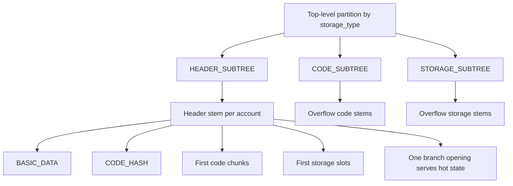

# EIP-7864: Partitioned Binary State Tree

## Network Handoff

For Ethereum Foundation or client-team evaluation artifacts, release-bundle steps, and readiness boundaries, see [EF_NETWORK_HANDOFF.md](EF_NETWORK_HANDOFF.md).

| Field | Value |
|---|---|
| EIP | 7864 |
| Title | Partitioned Binary State Tree |
| Status | Draft |
| Type | Standards Track – Core |
| Category | Core |
| Created | 2026-07-02 |

---

## Abstract

This EIP defines a Partitioned Binary Tree (PBT) as a replacement for Ethereum's hexary Patricia trie. The PBT stores fixed-width 32-byte values under prefix-free byte-string keys and unifies account header data, code chunks, and storage slots in one canonical binary structure. Two design primitives drive the layout: partitioning by one-byte `storage_type`, and 256-leaf locality groups called stems. The result is deterministic tree shape, uniform binary proofs, and better adjacent-access locality than the current trie.

The design removes RLP and variable node arity from state commitments, improving implementation simplicity and circuit-friendliness. It also reserves explicit extension space for expiry and metadata without changing existing proof paths. A stem-aware gas model and migration path from MPT are included. Hash function selection remains open; the reference implementation supports hash-function identifiers and ships BLAKE3 by default while including Keccak-256 and optional Poseidon2 integration hooks.

An optional non-consensus add-on specifies private stem retrieval and witness distribution primitives that preserve local verification as the correctness boundary.

## Executive Summary

This EIP replaces Ethereum's hexary Merkle Patricia Trie (MPT) with a Partitioned Binary Tree (PBT), a strictly binary state structure that stores account headers, contract code, and storage as fixed 32-byte values under prefix-free keys.

The design is verification-first. It is intended to make local verification practical on consumer hardware, improve locality, reduce circuit complexity, preserve hash agility, and reserve extension space for pruning, expiry, and metadata without requiring proof-format breaks.

### Motivation (Condensed)

The current MPT presents three structural constraints:

- variable proof paths with weak locality,
- RLP-heavy node encoding that increases prover and implementation complexity,
- no first-class layout for locality-driven access or future state-management features.

PBT addresses these constraints through strict binary branching, stem-based locality, and explicit extension hooks.

### Design Goals (Condensed)

- proofs SHOULD be short and predictable,
- adjacent accesses SHOULD share witness material via first-class locality,
- structure SHOULD remain circuit-friendly (binary branching, fixed-width nodes, no RLP),
- tree shape MUST remain independent of a specific hash function choice,
- reserved space MUST support expiry and metadata extensions,
- canonical form MUST be deterministic and incrementally adoptable.

### Specification Snapshot (Condensed)

- Tree is strictly binary.
- Node set is `EmptyNode`, `InternalNode`, `StemNode`.
- Key layout is `storage_type || tree_position || subindex`.
- Each stem groups 256 fixed 32-byte leaves.
- Partition bytes are `0x00` (account headers), `0x01` (contract code), and `0xff` (contract storage).

Simplified key primitive:

```python
def get_tree_key(storage_type: int, tree_position: bytes, subindex: int) -> bytes:
    return bytes([storage_type]) + tree_position + bytes([subindex])
```

Header stems co-locate basic account data, code hash, first code chunks, and first storage slots. Overflow code/storage spill into additional stems while preserving locality by grouped indexing.

### Gas And Migration (Condensed)

Stem-aware accounting is introduced:

- first access to a stem pays branch-opening cost,
- subsequent accesses within the same stem pay lower per-chunk cost.

This SHOULD create a direct economic incentive for locality-friendly access patterns.

Migration is two-phase at hard fork:

1. deterministic conversion block from MPT state to PBT state,
2. post-fork writes target PBT only, while MPT remains available for historical pre-fork proofs.

### Rationale Highlights

Compared with MPT, PBT provides a more uniform proof model, better locality, and simpler implementation/proving paths.

Compared with Verkle-style commitments, PBT keeps hash-based assumptions, improves post-quantum transition posture, and allows hash-function replacement without tree-structure redesign.

### Privacy, Extensions, And Security

Stem locality naturally supports efficient private retrieval composition (for example, multi-provider and oblivious-style retrieval), while keeping local verification as the correctness boundary.

Reserved subindex and/or `storage_type` space enables expiry, hot/cold hints, and archival metadata without changing existing Merkle paths.

Security relies on strong hash pre-image resistance, canonical-form enforcement, and witness completeness for stateless validation.

### Backward Compatibility

This change requires a hard fork. Pre-fork blocks continue to use MPT proofs; post-fork state and proof flows are PBT-native.

### Appendix: Broader Vision (Non-Normative)

The longer-term direction supported by this design includes:

- practical local verification on consumer devices,
- reduced reliance on centralized RPC trust assumptions,
- cleaner state-expiry and pruning evolution,
- reduced proving costs for future execution models.

### Simple Overview



## Motivation

The hexary Patricia trie (MPT) has three fundamental problems that motivate replacement:

1. **Proof shape and verifier simplicity.** A hexary tree over an address space of size $N$ produces proofs of depth $\lceil \log_{16} N \rceil$, which is approximately 8 nodes for the current state size. A binary tree uses $\lceil \log_2 N \rceil \approx 32$ bit-steps with a much simpler node type and fixed branching at every step. The result is a more uniform witness model and simpler verifier logic.
2. **RLP and variable node types.** The MPT mixes extension nodes, branch nodes, and leaf nodes encoded in RLP. This variable structure is expensive to represent in ZK circuits and makes canonical-form enforcement difficult across client implementations.
3. **No first-class locality.** The MPT has no notion of grouping related data. Every account field, code byte, and storage slot is an independent trie path. Adjacent accesses do not share witnesses.

PBT addresses these directly: binary branching removes variable-arity trie logic, stems provide explicit locality, and storage-type partitioning enables independent handling of header, code, and storage flows.

### Why Not Verkle?

| Dimension | Verkle (KZG/IPA commitments) | PBT (hash-based binary tree) |
|---|---|---|
| Cryptographic assumption | Elliptic-curve polynomial commitments | Collision-resistant hash function |
| Post-quantum posture | Weaker long-term posture (curve assumptions) | Hash agility; easier PQ migration path |
| Circuit model | More complex opening arithmetic | Bit tests + fixed-width hashes |
| Structural agility | Commitment swap may require structural redesign | Hash swap keeps tree shape/proof flow |
| Locality primitive | Not inherent | First-class stems (256 leaves) |

## Design Philosophy

The core design goal is a canonical state structure that is easier to verify locally and easier to evolve safely. Broader ecosystem goals (consumer-device verification targets, formal-verification process, decentralization metrics, and long-horizon cryptographic policy) are important but are maintained in a companion document so this EIP can stay focused on consensus-critical tree mechanics.

### Working Name And Messaging

For ecosystem communication, implementations MAY use a product-facing label such as "Verifiable State Tree" (or "Stem State") while preserving the normative technical name Partitioned Binary Tree in specification text.

A concise adoption message is: "Ethereum: verify, do not trust."

## Scope And Companion Principles

This EIP is scoped to the state-tree structure, key derivation, node semantics, proof model, gas-accounting hooks, and migration mechanics.

Broader ecosystem principles are split into a companion document: [ETHEREUM_EVOLUTION_PRINCIPLES.md](ETHEREUM_EVOLUTION_PRINCIPLES.md).

RFC 2119 keywords in this document apply to consensus-critical behavior unless explicitly marked as optional/non-consensus guidance.

### Consensus Boundary Map

Consensus-critical scope in this document includes:

- canonical tree structure and node semantics,
- key derivation and hashing domains for state commitments,
- proof verification rules and canonical-form invariants,
- migration mechanics and activation constraints.

Non-consensus policy and ecosystem scope includes:

- consumer-hardware verification budgets and rollout targets,
- roadmap framing (including The Verge alignment and VM co-design expectations),
- deployment priorities, adoption incentives, and communication guidance,
- optional witness delivery and compression deployment profiles.

## Evaluation Criteria

The core design is evaluated against tree-level outcomes:

- deterministic canonical structure for any `(key, value)` set,
- predictable proof construction and verification,
- measurable locality gains from stems,
- extension compatibility for expiry/metadata,
- compatibility with private retrieval compositions.

## Success Metrics (12-24 Months Post-Activation, Non-Consensus)

Ecosystem stakeholders SHOULD publish progress against measurable outcomes:

- share of major wallets that perform local verification by default for balance and token reads,
- median and p95 single-key proof payload sizes for common wallet queries,
- median verified balance-check latency on mid-range Android devices,
- concentration of RPC query flows across top providers before and after verified retrieval rollout,
- adoption of stem-aware caching in wallet and light-client implementations.

### Quantitative Success Metrics (Non-Consensus)

| Metric | Target | Measurement Window |
|---|---|---|
| Average witness size for account access | < 10 KB | 12 months post-activation |
| Validators running stateless or partially stateless clients | > 50% | 24 months post-activation |
| Reduction in centralized RPC usage for balance checks | publish measurable network-wide reduction target before fork activation | 12-24 months post-activation |
| End-to-end proving cost reduction vs EVM+MPT baseline | publish explicit target percentage at activation, with quarterly updates | 12-24 months post-activation |

## Verification on Consumer Hardware (Non-Consensus)

This EIP defines a phone-grade north-star deliverable: local verification MUST be practical on consumer hardware, not only on desktop-class machines.

### Verification Budget Targets

| Device Class | Max RAM | Max Sync Time | Max Proof Verify Time per Block | Target |
|---|---:|---:|---:|---|
| Mid-range Phone (2026) | 512 MB | < 30s | < 2s | Full verification |
| High-end Phone | 1 GB | < 10s | < 500ms | Default wallet mode |

### Minimal Verifier Spec (Cross-Fork Budget Invariant)

The ecosystem SHOULD maintain a canonical Minimal Verifier profile (Rust and/or WASM) with the following properties:

- verifies canonical header linkage and PBT state roots,
- verifies single-key and multi-key stem proofs,
- enforces deterministic proof-shape and canonical-node checks,
- runs within the budget table above on representative phone hardware.

Across fork upgrades, this Minimal Verifier profile MUST remain within the budget envelope or activation planning MUST publish an explicit mitigation path and timeline to restore budget compliance.

## Specification

### Design Goals

The design SHALL satisfy the following requirements:

1. Short and predictable Merkle proofs for light clients and stateless execution.
2. Strong locality so that adjacent header, code, and storage accesses share a stem.
3. A single canonical keyspace with no ambiguous encodings.
4. No extension nodes; the minimal internal-node structure MUST be deterministic.
5. Compatibility with ZK execution pipelines: fixed-width hashes, binary branching, and no variable-arity node logic.

### Parameters

| Constant | Value | Notes |
|---|---|---|
| `HEADER_SUBTREE` | `0` | `storage_type` for account header data |
| `CODE_SUBTREE` | `1` | `storage_type` for contract code chunks |
| `STORAGE_SUBTREE` | `255` | `storage_type` for contract storage |
| `BASIC_DATA_LEAF_KEY` | `0` | subindex of the basic-data leaf in the header stem |
| `CODE_HASH_LEAF_KEY` | `1` | subindex of the code-hash leaf in the header stem |
| `CODE_OFFSET` | `4` | first subindex used for code chunks in the header stem |
| `HEADER_STORAGE_OFFSET` | `20` | first subindex used for storage slots in the header stem |
| `CODE_CHUNKS_IN_HEADER` | `16` | number of code chunks co-located in the header stem |
| `STORAGE_CHUNKS_IN_HEADER` | `4` | number of storage slots co-located in the header stem |
| `STEM_SUBTREE_WIDTH` | `256` | number of leaf slots per stem |
| `MAIN_STORAGE_OFFSET` | $256^{31}$ | page offset for overflow storage stems |
| `HEADER_CODE_RANGE` | `4..19` | inclusive code-chunk subindex window in header stem |
| `HEADER_STORAGE_RANGE` | `20..23` | inclusive storage-slot subindex window in header stem |

**Constraints that MUST hold:**

$$\text{STEM\_SUBTREE\_WIDTH} > \text{HEADER\_STORAGE\_OFFSET} > \text{CODE\_OFFSET} > \text{CODE\_HASH\_LEAF\_KEY}$$

$$\text{MAIN\_STORAGE\_OFFSET} = \text{STEM\_SUBTREE\_WIDTH}^{31}$$

### Hash Function Strategy

#### Poseidon2 Integration Profile

Implementations MAY use Poseidon2 as the active tree hash function, especially in proving-oriented deployments.

Recommended profile (non-normative until finalized in reference vectors):

- Poseidon2 permutation parameters targeting ~256-bit security over the selected field (for example, BN254 or BLS12-381),
- 2-to-1 or rate-1 hash mode,
- 8-12 rounds depending on the audited parameter set and backend.

When Poseidon2 is selected, both of the following MUST use the same Poseidon2 profile:

- `tree_hash(left ++ right)` in internal-node hashing,
- `_hash_stem(prefix ++ values)` / stem payload hashing.

Implementations MUST support hash-function identifiers so a future hard fork can upgrade the active hash without changing tree structure, key derivation, or proof shape.

Each consensus deployment profile MUST pin exactly one active `hash_id` at activation (for example, `blake3`, `keccak256`, or `poseidon2`) and include that identifier in fork-level conformance documentation.

The reference implementation includes built-in hash IDs and switching hooks for:

- `blake3` (default),
- `keccak256`,
- `poseidon2` (enabled when a compatible backend is present).

#### Appendix B: Poseidon2 Circuit & STARK Considerations (Non-Normative)

This subsection highlights why Poseidon2 is strategically important for proving-oriented deployments.

#### Circuit Cost Profile

In ZK circuits, Poseidon2-based hashing is typically much cheaper than Keccak-style hashing and often materially cheaper than BLAKE3-style constructions. For hash-heavy witness checks, teams commonly target order-of-magnitude constraint reductions, depending on backend and parameter set.

For PBT specifically, this applies directly to both dominant hash paths:

- internal node hashing via `tree_hash(left ++ right)`,
- stem commitments via `_hash_stem(prefix ++ values)`.

Because PBT is strictly binary and fixed-width, replacing the hash backend does not change tree structure, key semantics, or proof shape.

#### STARK-Friendly Execution Considerations

For STARK and STARK-adjacent proving stacks, Poseidon2 can reduce trace and algebraic complexity relative to non-native hash choices, especially when large witness sets contain many branch checks and stem commitments.

Implementations that use Binius-oriented proving backends MAY publish dedicated profile identifiers (for example, `*_binius`) with measured trace-row and constraint-count deltas so cross-client benchmarking remains reproducible.

Recursive STARK pipelines SHOULD publish both base and recursive cost estimates (trace rows and constraint counts) per profile and recursion layer so verifier aggregation tradeoffs are explicit.

This makes PBT especially attractive for:

- zkEVM proving systems,
- stateless witness provers,
- future prover-friendly execution environments.

#### Poseidon2 + STARK Optimized Gadget Reference Track (Non-Normative)

Client teams SHOULD maintain a public circuit-gadget reference track for PBT hash operations across proving stacks (for example, Plonky3, Circle STARK, and Binius) and publish:

- audited gadget definitions for internal-node and stem hashing,
- reproducible constraint-count and trace-row benchmarks,
- compatibility vectors that demonstrate identical key-path behavior across gadget backends.

#### Implementation Guidance

- Consensus profiles SHOULD pin one `hash_id` per activation and publish the exact Poseidon2 parameter tuple in conformance artifacts.
- Client teams SHOULD benchmark both proving-time and native verification-time performance on representative workloads (wallet reads, multi-key proofs, and block execution traces).
- Client teams SHOULD publish component-level constraint-count estimates (internal-node hashes, stem hashes, and auxiliary hashes) alongside total estimates.
- Production rollouts SHOULD include cross-client vectors that verify identical key-path behavior across all supported hash profiles.

### Tree Model

The PBT stores prefix-free byte-string keys with 32-byte values.

Each key has the form:

```
bytes([storage_type]) + tree_position + bytes([subindex])
```

where:
- `storage_type` is a single byte identifying the partition.
- `tree_position` is a prefix-free byte string identifying the account or page within that partition.
- `subindex` is a single byte (0–255) selecting a leaf within the stem.

Keys sharing the same `(storage_type, tree_position)` form a **stem**. A stem contains exactly `STEM_SUBTREE_WIDTH` (256) leaf slots indexed by `subindex`. Unset slots hold `EMPTY_VALUE` (32 zero bytes).

The tree is strictly binary with the following invariants:

- If traversal reaches an empty node, the empty node MUST be replaced by a new `StemNode`.
- If an inserted stem conflicts with an existing `StemNode`, `InternalNode`s MUST be introduced based solely on the longest common bit-prefix of the two stem prefixes.
- Extension nodes MUST NOT be used.
- The resulting structure MUST be the unique canonical minimal binary tree for the given key set.
- An `InternalNode` with two `EmptyNode` children MUST NOT exist in any valid tree.

### Partitioning And Locality

The three storage types (`HEADER_SUBTREE`, `CODE_SUBTREE`, `STORAGE_SUBTREE`) occupy disjoint subtrees of the top-level binary tree because their `storage_type` bytes differ. This enables independent synchronisation, differentiated caching, and separate storage strategies per type.

The stem width of 256 defines the basic locality unit. A stem holds all 256 leaves for a given `(storage_type, tree_position)` pair under a single `StemNode`. Reads within the same stem share a single branch opening.

Locality is a first-class cost model: the key derivation functions in this EIP are designed so that the most frequently co-accessed data for any account maps to the same stem wherever possible.

### Pages And Co-Location Guarantees

The header stem for a given address holds:

| Subindex range | Contents |
|---|---|
| `0` | `BASIC_DATA_LEAF_KEY`: version, balance, nonce, code size |
| `1` | `CODE_HASH_LEAF_KEY`: code hash |
| `2–3` | reserved |
| `CODE_OFFSET` … `CODE_OFFSET + CODE_CHUNKS_IN_HEADER - 1` | first 16 code chunks (496 bytes of code) |
| `HEADER_STORAGE_OFFSET` … `HEADER_STORAGE_OFFSET + STORAGE_CHUNKS_IN_HEADER - 1` | first 4 storage slots |
| remaining | reserved for future use |

Consequently a contract with at most 496 bytes of code and at most 4 hot storage slots can have its entire frequently-accessed state served from a single stem opening.

Larger code and storage are distributed across additional stems in `STEM_SUBTREE_WIDTH`-sized groups. Every `STEM_SUBTREE_WIDTH` consecutive code chunks or storage slots share one stem, so sequential access patterns within a range stay local.

If data are mapped into the same stem, the tree MUST keep them under the same `StemNode` until the stem is full.

**Worked example.** A small ERC-20 token contract with 400 bytes of bytecode, a balance mapping, and 3 hot slots has all of the following in one header stem: `BASIC_DATA`, `CODE_HASH`, chunks 0–12 (covering all 400 bytes), and slots 0–2. A single branch opening serves the entire hot state of the contract.

### Key Derivation

All keys are derived from the following primitive, which MUST be implemented as specified:

```python
def get_tree_key(storage_type: int, tree_position: bytes, subindex: int) -> bytes:
    assert 0 <= storage_type <= 255
    assert 0 <= subindex < STEM_SUBTREE_WIDTH
    return bytes([storage_type]) + tree_position + bytes([subindex])
```

#### Domain Separation For Tree Positions

Implementations SHOULD domain-separate preimages before hashing `tree_position` material. A recommended pattern is:

```python
HEADER_DOMAIN = b"PBT:HEADER:v1"
CODE_DOMAIN = b"PBT:CODE:v1"
STORAGE_DOMAIN = b"PBT:STORAGE:v1"
```

and then hash `domain || address || optional_page_material`.

#### Account Header Keys

```python
def get_tree_key_for_basic_data(address: Address32) -> bytes:
    tree_position = hash(HEADER_DOMAIN + address)
    return get_tree_key(HEADER_SUBTREE, tree_position, BASIC_DATA_LEAF_KEY)

def get_tree_key_for_code_hash(address: Address32) -> bytes:
    tree_position = hash(HEADER_DOMAIN + address)
    return get_tree_key(HEADER_SUBTREE, tree_position, CODE_HASH_LEAF_KEY)
```

The `BASIC_DATA` leaf encodes four fields in exactly 32 bytes, big-endian:

```
bytes 0–3:   version    (uint32)
bytes 4–11:  balance    (uint64)
bytes 12–19: nonce      (uint64)
bytes 20–31: code_size  (uint96)
```

#### Code Keys

Contract bytecode is divided into 31-byte chunks. Each chunk is stored as a 32-byte leaf value:

```
byte  0:     pushdata_offset  – number of leading bytes in this chunk that are
                                PUSH operand data carried over from the previous chunk
bytes 1–31:  code_slice       – the 31 bytes of bytecode (zero-padded at the end)
```

```python
def get_tree_key_for_code_chunk(address: Address32, chunk_id: int) -> bytes:
    header_position = hash(HEADER_DOMAIN + address)
    if chunk_id < CODE_CHUNKS_IN_HEADER:
        return get_tree_key(
            HEADER_SUBTREE,
            header_position,
            CODE_OFFSET + chunk_id,
        )
    overflow = chunk_id - CODE_CHUNKS_IN_HEADER
    high = overflow // STEM_SUBTREE_WIDTH
    low  = overflow % STEM_SUBTREE_WIDTH
    code_position = hash(CODE_DOMAIN + address + int_to_bytes32(high))
    return get_tree_key(
        CODE_SUBTREE,
        code_position,
        low,
    )
```

#### Storage Keys

```python
def get_tree_key_for_storage_slot(address: Address32, storage_key: int) -> bytes:
    header_position = hash(HEADER_DOMAIN + address)
    if storage_key < STORAGE_CHUNKS_IN_HEADER:
        return get_tree_key(
            HEADER_SUBTREE,
            header_position,
            HEADER_STORAGE_OFFSET + storage_key,
        )
    overflow = storage_key - STORAGE_CHUNKS_IN_HEADER
    high = overflow // STEM_SUBTREE_WIDTH
    low  = overflow % STEM_SUBTREE_WIDTH
    storage_position = hash(STORAGE_DOMAIN + address) + hash(
        STORAGE_DOMAIN + address + int_to_bytes32(high)
    )
    return get_tree_key(
        STORAGE_SUBTREE,
        storage_position,
        low,
    )
```

The storage overflow double-hash construction prevents adversarial alignment: two different contracts cannot be forced to share a `tree_position`, and two different page indices for the same contract produce different positions.

### Node Types

Implementations MUST use exactly three node types:

| Type | Description |
|---|---|
| `EmptyNode` | explicit sentinel representing an absent subtree; MUST NOT be omitted or replaced by `None` |
| `InternalNode` | binary branch with `left` and `right` children, each a `Node`; MUST carry a cached 32-byte subtree hash |
| `StemNode` | holds `stem_prefix` and a fixed-length array `values[STEM_SUBTREE_WIDTH]` of 32-byte leaves |

The insertion algorithm is normative. Implementations MUST follow it exactly to maintain a canonical tree:

```python
def insert(root: Node, key: bytes, value: bytes) -> Node:
    assert len(value) == 32
    stem_prefix, subindex = key[:-1], key[-1]
    return _insert(root, stem_prefix, subindex, value, depth=0)

def _insert(node: Node, stem_prefix: bytes, subindex: int,
            value: bytes, depth: int) -> Node:
    if isinstance(node, EmptyNode):
        stem = StemNode(stem_prefix=stem_prefix,
                        values=[EMPTY_VALUE] * STEM_SUBTREE_WIDTH)
        stem.values[subindex] = value
        return stem

    if isinstance(node, StemNode):
        if node.stem_prefix == stem_prefix:
            node.values[subindex] = value
            return node
        # The two stems diverge at bit `depth`; introduce the minimum
        # number of InternalNodes to separate them.
        return _split(node, stem_prefix, subindex, value, depth)

    # InternalNode: descend by the bit at position `depth`.
    bit = _bit_at(stem_prefix, depth)
    if bit == 0:
        node.left = _insert(node.left, stem_prefix, subindex, value, depth + 1)
    else:
        node.right = _insert(node.right, stem_prefix, subindex, value, depth + 1)
    return node

def _split(existing: StemNode, new_prefix: bytes, subindex: int,
           value: bytes, depth: int) -> Node:
    bit_existing = _bit_at(existing.stem_prefix, depth)
    bit_new      = _bit_at(new_prefix, depth)
    if bit_existing == bit_new:
        # Keep descending until the prefixes diverge.
        child = _split(existing, new_prefix, subindex, value, depth + 1)
        node = InternalNode(left=EmptyNode(), right=EmptyNode())
        if bit_existing == 0:
            node.left = child
        else:
            node.right = child
        return node
    # Prefixes diverge here; place each stem on its own side.
    new_stem = StemNode(stem_prefix=new_prefix,
                        values=[EMPTY_VALUE] * STEM_SUBTREE_WIDTH)
    new_stem.values[subindex] = value
    node = InternalNode(left=EmptyNode(), right=EmptyNode())
    if bit_new == 0:
        node.left, node.right = new_stem, existing
    else:
        node.left, node.right = existing, new_stem
    return node

def _bit_at(data: bytes, position: int) -> int:
    byte_index, bit_index = divmod(position, 8)
    if byte_index >= len(data):
        return 0
    return (data[byte_index] >> (7 - bit_index)) & 1
```

After every insert the tree MUST satisfy:
- No `InternalNode` with both children `EmptyNode`.
- No two distinct key sets produce the same tree structure.
- The Merkle root hash is deterministic given the set of `(key, value)` pairs.

Equivalently, the tree is the unique minimal binary tree representing the set of stems.

### Circuit Model And Proving Cost

The tree is a circuit-friendly object. Implementations intended for use in ZK pipelines MUST rely only on the following primitive operations:

- single-bit extraction from a fixed-width byte string,
- 32-byte equality comparison,
- fixed-width hash of a fixed-width input.

No variable-arity node logic, no extension-node decompression, and no RLP parsing are required at any point in a proof path.

Expected witness-cost properties:

- The Merkle path length for any key is at most `8 × len(stem_prefix)` bits, bounded by the key length, not by the number of keys in the tree.
- Adjacent accesses within the same stem share one branch opening; $k$ accesses to the same stem cost $O(1)$ branch openings regardless of $k$.
- Worst-case proof size for a single key is $O(\text{key\_bits})$ hashes, with a fixed branching factor of 2 at every level.

In proving systems, Poseidon2-based hashing can significantly reduce constraint cost versus Keccak-oriented circuits; practical deployments often report order-of-magnitude reductions for hash-heavy witness checks.

### Metadata And State-Expiry Hooks

The design MUST reserve a clear extension point for future metadata. Implementations MUST define explicit reserved metadata space, either via reserved subindex ranges, reserved `storage_type` partitions, or both, and MUST publish that reservation map as part of consensus constants before activation. Reserved metadata space is used for:

- expiry epoch buckets,
- hot/cold classification flags,
- archival-tier handling bits,
- or other future state-management annotations.

These bits MUST have a defined home before they are needed, not bolted on after the fact. Allocating metadata to reserved leaf indices or to reserved `storage_type` values ensures future extensions can be introduced without changing Merkle paths, circuit assumptions, or existing proof formats.

This extension point is the designed path for state expiry: when expiry semantics are adopted, an epoch identifier or last-access hint can be stored in a reserved leaf adjacent to the data it annotates, without restructuring the tree.

### Partial State Expiry Mechanism (Draft, First-Class Extension Path)

This EIP defines a concrete partial-expiry mechanism shape for reserved metadata space, even when activation is deferred to a companion fork.

Required metadata fields per account/stem expiry domain:

- `expiry_epoch`: epoch after which state enters expiry handling,
- `last_access_epoch`: rolling hint for grace and revival policy,
- `expiry_flags`: bitfield for active, grace, expired, archived, and revival-required statuses.

Draft transition model:

1. Active: `current_epoch < expiry_epoch`.
2. Grace: `current_epoch >= expiry_epoch` and within configured grace window.
3. Expired: beyond grace window; reads/writes require expiry-aware witness handling.
4. Revived: state may re-enter active mode only with valid revival witness linkage.

Consensus-critical activation details remain in a companion EIP, but the metadata home, proof compatibility constraints, and transition-shape expectations are intentionally defined here as first-class protocol direction.

## Rationale For Tree Selection

### Versus Hexary Patricia Trie

| Property | MPT | PBT |
|---|---|---|
| Encoding | RLP, variable node types | fixed-width binary nodes |
| Canonical form | implementation-defined | algorithmically enforced |
| Proof structure | variable hexary branching | uniform binary branching |
| ZK circuit cost | high (variable-arity, RLP) | low (bit tests, fixed-width hashes) |
| Locality | none | first-class via stems |

### Versus Verkle Trees / Polynomial Commitments

Verkle trees reduce proof size by using polynomial commitments and vector openings. The tradeoffs are:

- Verkle proofs rely on elliptic-curve assumptions (KZG or IPA) that are not post-quantum secure.
- Circuit representation of polynomial commitment schemes is more complex than binary hashing.
- Cryptographic agility — swapping the commitment scheme — requires restructuring the tree.

PBT avoids these issues by using a plain hash function. The hash function is swappable without changing the tree structure or the proof format. This is the safer long-term design choice: the structure does not bet on one algebraic assumption remaining tractable.

Related lines of work include Stateless Ethereum witness design efforts and Verkle migration research; this proposal diverges by prioritizing hash-only commitments and explicit stem-locality economics.

### Why Poseidon2 Is Attractive For PBT

- Binary branching plus Poseidon2 yields a prover-friendly composition for zkEVM and stateless proving pipelines.
- Large witness sets (many stems) become materially cheaper to prove compared with Keccak-oriented hash paths.
- The same canonical tree model remains compatible with faster native hashes (for example, BLAKE3) in non-proving contexts.
- Hash agility is preserved: clients can run BLAKE3-oriented profiles today and migrate to Poseidon2-oriented profiles at fork boundaries through hash-function identifiers.

## Execution Layer Roadmap Compatibility (Non-Consensus)

The PBT is designed to be one half of a two-track execution-layer modernisation:

1. **State tree** (this EIP) — replaces the MPT with a structure that is binary, locality-aware, and hash-agnostic.
2. **VM** (separate EIP) — a more prover-friendly execution model (e.g., RISC-V-centric) reduces the proving cost of execution itself.

The tree is shaped to work with both current EVM execution and a future prover-friendly VM:

- Fixed-width hashes and binary branching map cleanly onto RISC-V memory access patterns.
- Stem-local access patterns reduce the number of distinct memory regions touched in a typical proof.
- The hash-agnostic design allows the proving stack to adopt a ZK-optimal hash (e.g., Poseidon2) without restructuring the tree.

State structure, execution model, and proving stack SHOULD be co-designed so that improvements in one do not introduce regressions in the others.

Together with a RISC-V-centric VM track, PBT + Poseidon2 is expected to reduce total proving cost by more than 80% relative to the current EVM + MPT baseline on representative execution workloads.

## Roadmap Integration: The Verge (Non-Consensus)

This EIP is explicitly aligned with The Verge priorities:

- statelessness via witness-friendly, canonical binary proofs,
- practical local verification on commodity devices,
- reduced dependence on centralized RPC trust through proof-carrying state access.

---

## Companion Principles (Non-Consensus)

This EIP intentionally focuses on consensus-critical state-tree mechanics. Broader ecosystem principles are maintained in [ETHEREUM_EVOLUTION_PRINCIPLES.md](ETHEREUM_EVOLUTION_PRINCIPLES.md).

Those companion principles cover:

- consumer-device verification goals,
- formal verification process and verifiability budgets,
- decentralization and L2 quality metrics,
- long-horizon cryptographic migration expectations,
- trust-minimized interoperability and governance guidance.

This EIP informatively references the companion document for ecosystem-level objectives, while consensus behavior remains fully specified by this EIP's tree structure, proofs, gas hooks, and migration semantics.

## Deployment Priorities (Non-Consensus)

The following work items are high-impact companions to this EIP and SHOULD be prioritized in parallel:

1. Ship a phone-grade verifier reference implementation (Rust and/or WASM) that verifies block headers, state transitions, and PBT proofs within practical mobile budgets.
2. Standardize a minimal verified-RPC companion protocol where responses include state proof material and header linkage for mandatory local verification.
3. Make hot-stem caching and adaptive multi-provider retrieval default in wallet SDKs.
4. Align gas incentives with verification-friendly behavior (cheap warm-stem access, explicit treatment of cold-stem openings, witness-aware transaction ergonomics).
5. Publish a public formal-verification dashboard that tracks proof coverage, proof-check status, and protocol-component verification gaps.
6. Define and activate a mandatory state-expiry companion protocol using reserved metadata locations, with deterministic transition rules and expiry-proof validation.
7. Adopt memorable ecosystem messaging for end users and integrators (recommended tagline: "Ethereum: verify, do not trust.") while keeping Partitioned Binary Tree as the normative technical name.
8. Publish and maintain a canonical phone-user journey (balance, token, NFT checks) with measurable SLOs for verified-read latency and failure-retry behavior.
9. Target default wallet local verification behavior within 12 months of activation for major wallet implementations.
10. Standardize `eth_getStemProof` and `eth_getVerifiedState` as baseline application-facing verified-RPC methods, alongside compatibility support for existing method names.

## Ecosystem Incentives And Verification Artifacts (Non-Consensus)

To accelerate adoption, ecosystem programs SHOULD include:

- a stem-locality incentive track (protocol or ecosystem-funded) rewarding contracts and tooling that materially reduce witness overhead,
- machine-checked formal artifacts (for example, Lean/Coq) covering insertion/deletion canonicality and proof verification invariants,
- public conformance dashboards that combine implementation status, proof coverage, and mobile-budget compliance telemetry.

## Branding Package (Non-Consensus)

The ecosystem SHOULD adopt a consistent, memorable public message for wallet users, SDK adopters, and infrastructure operators.

Normative technical name:

- Partitioned Binary Tree (PBT)

Recommended public-facing product label:

- Verifiable State Tree

Primary tagline:

- Ethereum: verify, do not trust.

One-page vision summary:

- [VISION_ONE_PAGER.md](VISION_ONE_PAGER.md) — "Ethereum: Verify, don't trust — on your phone."

Secondary short lines for UX surfaces:

- Proofs, not promises.
- Your wallet verifies.
- Local checks. Global consensus.

Messaging rules:

- UI text that says "verified" SHOULD mean locally verified against a trusted root.
- UI text MUST distinguish unverified transport data from locally verified values.
- Specs, audits, and implementation docs MUST continue using the technical name Partitioned Binary Tree.

## Mandatory State Expiry Companion Proposal (Draft, Non-Consensus)

This section proposes a mandatory companion protocol for state expiry that uses reserved metadata locations defined by this EIP.

### Objectives

- bound long-run state growth,
- keep expiry logic proof-verifiable under the same local-verification pipeline,
- avoid changes to canonical key derivation and existing proof paths for non-expiry leaves.

### Expiry Metadata Model

At minimum, the companion protocol SHOULD define:

- expiry epoch metadata per account/stem,
- grace-window parameters,
- archival/revival markers for expired state recovery paths.

The metadata MUST live in reserved metadata locations and MUST NOT require a new trie shape.

### Core Invariants

- Expiry transitions MUST be deterministic given block data and protocol parameters.
- Non-expired state proofs MUST remain format-compatible with the existing PBT proof model.
- Expiry and revival proofs MUST be verifiable using the same root-anchored local verification boundary.
- Clients that do not implement expiry validation MUST be treated as non-conforming after activation.

### Proposed Phased Rollout

1. Definition phase:
    - finalize expiry metadata fields and wire semantics,
    - publish conformance vectors for active, grace, and expired states.
2. Shadow phase:
    - clients compute expiry metadata off-consensus and publish telemetry,
    - wallets and SDKs integrate expiry-proof verification in non-blocking mode.
3. Enforcement phase:
    - activate consensus enforcement at a scheduled fork,
    - require expiry-proof validation for stateless and partially stateless execution paths.

### Activation Readiness Criteria

- cross-client equivalence on expiry transition vectors,
- public dashboards showing expiry-proof conformance coverage,
- wallet and SDK support for verified handling of expired-state responses,
- published failure-mode playbooks for incorrect expiry metadata or missing revival witnesses.

### Validation Rules (High-Level)

Implementations SHOULD reject, at minimum:

- malformed expiry metadata proofs,
- inconsistent epoch transitions,
- revival attempts without required proof linkage,
- expiry state claims not anchored to the locally trusted root.

### Relationship To Core EIP

This proposal is companion guidance for rollout and policy. Consensus-critical expiry rules MUST be finalized in a dedicated companion EIP and activated through normal hard-fork coordination.

---

### Delete And Update Operations

**Delete.** Setting a leaf to `EMPTY_VALUE` is logically equivalent to deletion. After setting `stem.values[subindex] = EMPTY_VALUE`, if all 256 values in a `StemNode` are `EMPTY_VALUE`, the `StemNode` MUST be replaced by `EmptyNode`. After collapsing a `StemNode`, if the parent `InternalNode` now has one `EmptyNode` child and one `StemNode` child, the `InternalNode` MUST be replaced by the surviving `StemNode`. This ensures the canonical minimal structure is always maintained.

```python
def delete(root: Node, key: bytes) -> Node:
    stem_prefix, subindex = key[:-1], key[-1]
    return _delete(root, stem_prefix, subindex, depth=0)

def _delete(node: Node, stem_prefix: bytes, subindex: int, depth: int) -> Node:
    if isinstance(node, EmptyNode):
        return node  # nothing to delete

    if isinstance(node, StemNode):
        if node.stem_prefix != stem_prefix:
            return node  # key not present
        node.values[subindex] = EMPTY_VALUE
        if all(v == EMPTY_VALUE for v in node.values):
            return EmptyNode()
        return node

    bit = _bit_at(stem_prefix, depth)
    if bit == 0:
        node.left = _delete(node.left, stem_prefix, subindex, depth + 1)
    else:
        node.right = _delete(node.right, stem_prefix, subindex, depth + 1)

    # Collapse internal node if one side is now empty.
    if isinstance(node.left, EmptyNode) and not isinstance(node.right, EmptyNode):
        return node.right
    if isinstance(node.right, EmptyNode) and not isinstance(node.left, EmptyNode):
        return node.left
    if isinstance(node.left, EmptyNode) and isinstance(node.right, EmptyNode):
        return EmptyNode()
    return node
```

**Update.** Updating an existing leaf is identical to insert: call `insert(root, key, new_value)`. No special update path is required.

### Proof Generation And Verification

A Merkle proof for key $k$ in a tree with root hash $R$ is a sequence of sibling hashes along the path from the root to the `StemNode` containing $k$, plus the full `StemNode` values (or a subset, for multi-key proofs).

`tree_hash` MUST be deterministic over raw bytes and return exactly 32 bytes. Implementations MUST domain-separate at least empty-node, internal-node, and stem payload hashing domains.

```python
from dataclasses import dataclass, field

@dataclass
class MerkleProof:
    key: bytes
    value: bytes                   # 32 bytes; EMPTY_VALUE if absent
    stem_values: list[bytes]       # all 256 leaves of the stem (for single-key proofs)
    path_siblings: list[bytes]     # sibling hashes, root-to-leaf order
    path_bits: list[int]           # 0 = we went left, 1 = we went right

def get_proof(root: Node, key: bytes) -> MerkleProof:
    stem_prefix, subindex = key[:-1], key[-1]
    siblings: list[bytes] = []
    bits: list[int] = []
    node = root
    depth = 0
    while isinstance(node, InternalNode):
        bit = _bit_at(stem_prefix, depth)
        bits.append(bit)
        if bit == 0:
            siblings.append(_node_hash(node.right))
            node = node.left
        else:
            siblings.append(_node_hash(node.left))
            node = node.right
        depth += 1
    if isinstance(node, StemNode) and node.stem_prefix == stem_prefix:
        value = node.values[subindex]
        stem_values = list(node.values)
    else:
        value = EMPTY_VALUE
        stem_values = [EMPTY_VALUE] * STEM_SUBTREE_WIDTH
    return MerkleProof(
        key=key, value=value,
        stem_values=stem_values,
        path_siblings=siblings,
        path_bits=bits,
    )

def verify_proof(root_hash: bytes, proof: MerkleProof) -> bool:
    stem_prefix, subindex = proof.key[:-1], proof.key[-1]
    if proof.stem_values[subindex] != proof.value:
        return False
    # Recompute the stem hash.
    current = _hash_stem(stem_prefix, proof.stem_values)
    # Walk back up the path.
    for sibling, bit in zip(reversed(proof.path_siblings), reversed(proof.path_bits)):
        if bit == 0:
            current = tree_hash(current + sibling)
        else:
            current = tree_hash(sibling + current)
    return current == root_hash
```

`_hash_stem(stem_prefix, values)` MUST be defined as:

```python
def _hash_stem(stem_prefix: bytes, values: list[bytes]) -> bytes:
    # Domain-separated commitment to stem prefix and all 256 values.
    payload = b"PBT:STEM:v1" + stem_prefix + b"".join(values)
    return tree_hash(payload)
```

`_node_hash` for an `InternalNode` MUST be:

```python
def _node_hash(node: Node) -> bytes:
    if isinstance(node, EmptyNode):
        return EMPTY_HASH               # tree_hash(b"") precomputed
    if isinstance(node, StemNode):
        return _hash_stem(node.stem_prefix, node.values)
    return tree_hash(_node_hash(node.left) + _node_hash(node.right))
```

Multi-key proofs MAY share path prefixes and stem nodes; the proof format for multi-key witnesses is out of scope for this EIP but MUST be compatible with the single-key proof above.

A compatible multi-proof SHOULD include:

- deduplicated sibling hash set,
- explicit key-to-path index mapping,
- stem payload commitments (full or subset + commitment proof),
- deterministic ordering rules for all variable-length arrays.

### Multi-Key And Batch Proof Standard (Draft Profile, Non-Consensus)

To align with real wallet and block-witness workloads, implementations SHOULD support a canonical batch-proof profile with:

- deduplicated internal sibling set across all requested keys,
- canonical key ordering (lexicographic by full key bytes),
- explicit key-to-stem and key-to-path index tables,
- deterministic serialization for batch payloads.

Batch proofs SHOULD target minimal repetition of shared path and stem material while remaining locally verifiable with the same root-anchored verifier rules as single-key proofs.

### Witness Compression Wrapper (Optional, Non-Consensus)

Implementations MAY wrap canonical witness payloads in an optional SNARK/STARK compression envelope for ultra-small transport footprints.

When enabled, compressed witness responses MUST include:

- commitment to the exact canonical witness payload bytes,
- proof system identifier and version,
- verifier metadata sufficient for local verification,
- fallback path to canonical uncompressed witness material.

### Private Stem Retrieval (Optional Add-On)

#### EIP-7864 Add-On: Private Stem Retrieval and Witness Distribution Primitive

##### Abstract

This EIP MAY define an optional, minimal protocol primitive for privacy-preserving state access and local verification of stem-local state. The primitive allows wallets and clients to subscribe to relevant stems without revealing the exact accounts or storage keys they care about, and allows witness providers to deliver stem proofs through privacy-preserving channels. The design goal is to reduce RPC trust and metadata leakage, not to expand consensus complexity.

Witness delivery remains optional, but the protocol path is intentionally standardized: a minimal native path for private stem retrieval is preferred to fragmented off-chain convention.

An implementation-level execution trace of this flow is provided in [Demo Trace (Adaptive Fallback)](#demo-trace-adaptive-fallback).

EIP-7864 therefore treats stem locality as a privacy-preserving verification primitive, not merely as an off-chain witness-delivery convenience.

Hard constraints: the primitive is optional, local-verification-first, requires no registry for correctness, introduces no new trusted parties, and remains compatible with stateless and partially stateless clients.

##### Motivation

EIP-7864 makes stems the natural locality unit for state access. This creates an opportunity to standardize a privacy-preserving mechanism for clients that want to locally verify only the state they actually use, without exposing their query pattern to a single RPC provider. The goal is to make consumer-device verification more practical while reducing metadata leakage.

This add-on is intentionally non-invasive: the core tree design remains primary, while witness distribution is an optional layer for "local verification by default" workflows.

##### Design Principles

- Optional, non-invasive witness distribution.
- Minimal protocol surface with no required new consensus state.
- Consumer-device verifiability as a first-order objective.
- Minimize RPC metadata leakage and single-provider trust.
- Composable with stateless and partially stateless execution modes.
- Aligned with pruning and expiry evolution without requiring new coordination layers.
- Ephemeral state lenses: wallets MAY derive short-lived private views over only required stems, with optional one-time/bounded-use burn semantics, then automatically discard them after use.

##### Primitive Scope

This section specifies a minimal protocol path for obtaining and verifying relevant stems privately and locally.

The path is normative at the interface level (commitment, bundle, proof verification, validation rules) and intentionally non-prescriptive about transport internals. Implementations MAY choose different transport substrates as long as privacy and verification requirements in this section are preserved.

##### Minimal Verified-RPC Companion Protocol

A companion interface SHOULD standardize verified witness delivery over JSON-RPC with methods such as:

- `eth_getVerifiedProof`
- `eth_getStemWitness`

For ecosystem convergence, clients SHOULD additionally standardize aliases geared to app-facing integration:

- `eth_getStemProof`
- `eth_getVerifiedState`

Responses SHOULD include, at minimum:

- requested state payload,
- PBT proof payload,
- block-header linkage needed to verify root consistency,
- explicit versioning and serialization commitments.

Wallets and client SDKs SHOULD treat these responses as untrusted witness data until local verification succeeds.

##### Adaptive Private Retrieval Profile (Normative Add-On Profile, Non-Consensus Core)

Implementations conforming to this add-on profile MUST:

- attempt retrieval from at least two independent providers before accepting single-provider failure as terminal,
- enforce bounded retry budgets and deterministic fallback widening rules,
- keep verification as the acceptance boundary for all retries and provider combinations.

Implementations SHOULD:

- widen both provider set and bucket coverage under under-quorum conditions,
- include optional cover fetches for stronger query-pattern privacy,
- persist reliability telemetry to improve future retrieval plans without weakening correctness checks.

##### Trust Model

The primitive MUST NOT introduce new trusted parties. Witness providers, relays, brokers, bulletin layers, and storage layers are untrusted transport surfaces.

Correctness MUST come from local proof verification against a locally verified header/root pipeline, not from provider reputation, signatures, or registry membership.

Provider attestations MAY be carried for observability or accountability, but they MUST NOT be treated as sufficient for state correctness.

##### Specification

A client MAY create a short-lived Interest Commitment representing a rotating set of stems it expects to query. The commitment MUST be time-limited and SHOULD be unlinkable across epochs.

Witness providers MAY publish Witness Bundles containing:

- the stem values needed to verify a set of relevant leaves,
- the sibling hashes required to reconstruct the Merkle path,
- a block reference,
- and an optional provider attestation.

Witness Bundles MUST be decryptable only by clients holding the corresponding ephemeral key, or retrievable through an oblivious access method such as PIR, ORAM, or equivalent privacy-preserving transport.

The primitive MUST remain optional and MUST NOT modify canonical tree structure, root computation, or proof rules in EIP-7864.

The primitive MUST be composable: clients MAY use it alongside existing RPC/state-sync mechanisms, and implementations MUST NOT require a dedicated global coordinator to participate.

Implementations MUST support local verification by default: delivered witness data are untrusted until proof checks pass. If checks fail or data are incomplete, the client MUST reject and retry via another transport/provider path.

Implementations SHOULD use adaptive fallback by default (for example, widening provider sets, widening bucket scans, and enforcing bounded retry budgets) so temporary under-delivery does not silently degrade correctness or privacy posture.

##### Hot Stem Caching And Adaptive Retrieval

Clients SHOULD maintain a small local cache of recently verified hot stems (for example, account headers and frequently used storage stems) to reduce repeated branch openings and improve UX latency.

Recommended retrieval behavior:

- begin with a narrow provider set and small bucket window,
- widen provider and bucket selection on under-quorum or malformed responses,
- use configurable quorum thresholds for correctness under partial failure,
- optionally include dummy/cover fetches for stronger query-pattern privacy.

Implementations SHOULD ensure that no single server learns the full query pattern of a client session; redundant retrieval, oblivious retrieval, or equivalent privacy-preserving composition SHOULD be used to meet this objective.

The protocol SHOULD support the following retrieval modes:

- Encrypted rendezvous delivery, where providers post encrypted bundles to a public bulletin or storage layer.
- Redundant multi-provider retrieval, where clients request the same witness from multiple providers and compare results.
- PIR-style retrieval, where the provider cannot determine which bundle was requested.

##### Verification Flow

A client that receives a Witness Bundle MUST verify:

1. the stem root against the canonical block header root,
2. the sibling path against the binary tree rules in EIP-7864,
3. and the leaf values against the local state transition being applied.

If the witness is incomplete or malformed, the client MUST reject it and MAY retry from another provider.

##### Stateless Compatibility

This primitive is designed to compose with both stateless and partially stateless clients.

- A stateless client MAY request only the stems needed for current execution and discard them after verification.
- A partially stateless client MAY retain a rolling local cache of hot stems and fetch misses through the same primitive.
- In both modes, the verification rule is identical: witnesses are accepted only after local proof verification against the canonical root.

No additional trusted sync role is required for either client mode.

##### Pruning And Expiry Alignment

This primitive MUST remain compatible with future pruning and state-expiry semantics.

- Witness bundles MAY include expiry-related metadata proofs only from reserved metadata locations defined by this EIP.
- Introducing expiry metadata through reserved space MUST NOT change canonical key derivation, tree shape rules, or proof verification flow for existing leaves.
- Clients that are stateless or partially stateless MUST be able to verify expiry-related metadata with the same local-verification pipeline used for ordinary stem leaves.

##### Privacy Requirements

Clients SHOULD rotate Interest Commitment keys frequently. Providers SHOULD aggregate many client commitments before serving bundles, to increase anonymity sets. Implementations SHOULD support dummy fetches or cover traffic when stronger privacy is desired.

##### Optional Registry

An optional registry MAY allow users to post small bonded commitments to chosen witness providers. Providers MAY advertise latency and availability guarantees, and MAY be penalized for repeated non-delivery.

The registry is explicitly non-core: implementations MUST function without it, and the base protocol MUST NOT depend on registry participation for correctness or liveness.

##### Non-Requirements

- No mandatory on-chain registry.
- No mandatory trusted relay network.
- No mandatory provider attestation format for correctness.
- No mandatory global coordinator or scheduling service.
- No changes to canonical EIP-7864 state transition or root derivation rules.

##### Rationale

This design turns stem locality into a privacy-preserving protocol primitive rather than just an efficiency optimization. It also creates a standardized path for partially stateless clients, mobile verifiers, and privacy-aware wallets to participate without trusting a single RPC endpoint.

The intention is less trust, less leakage, and easier local verification on normal devices, not a broad feature pile.

EIP-7864 should do more than compress Ethereum state proofs; it should make private, locally verifiable state access a first-class protocol property. In practical terms, stem locality should function as a privacy-preserving verification primitive so users can verify their own state without relying on a single trusted RPC provider.

##### Backward Compatibility

This primitive is additive and does not alter the canonical state tree, proof format, or root hash rules defined by EIP-7864.

##### Stronger Variant

For higher privacy deployments, the preferred variant is:

- subscription commitments are on-chain,
- witness bundles are encrypted off-chain,
- and retrieval is PIR-backed by default for wallets opting into high privacy.

The following canonical wire format applies to the add-on primitive above.

#### Canonical Wire Format

This section defines a canonical binary wire format so independent clients can interoperate.

**Encoding rules (global):**

- Unsigned integers are big-endian.
- `bytesN` means exactly `N` bytes.
- `u16_len || bytes` means a 2-byte length prefix followed by that many bytes.
- `u32_len || bytes` means a 4-byte length prefix followed by that many bytes.
- Field order is normative and MUST be preserved.

##### 1. Subscription Registration Record (`SUB_REG_V1`)

| Field | Type | Size (bytes) | Notes |
|---|---|---:|---|
| `version` | `u8` | 1 | MUST be `1` |
| `commitment` | `bytes32` | 32 | commitment over wallet secret/policy |
| `window_start_epoch` | `u64` | 8 | inclusive |
| `window_end_epoch` | `u64` | 8 | inclusive |
| `max_buckets_per_epoch` | `u32` | 4 | anti-DoS retrieval budget |
| `encryption_pubkey` | `u16_len || bytes` | variable | optional; `len=0` allowed |

`SUB_REG_V1` total size is `53 + len(encryption_pubkey)` bytes.

##### 2. Stem Witness Packet Record (`STEM_PKT_V1`)

| Field | Type | Size (bytes) | Notes |
|---|---|---:|---|
| `version` | `u8` | 1 | MUST be `1` |
| `epoch` | `u64` | 8 | distribution epoch |
| `block_number` | `u64` | 8 | source block number |
| `block_root` | `bytes32` | 32 | verified state root |
| `bucket_id` | `u32` | 4 | distribution bucket |
| `stem_prefix` | `u16_len || bytes` | variable | canonical stem prefix |
| `key` | `u16_len || bytes` | variable | full tree key |
| `value` | `bytes32` | 32 | leaf value |
| `proof_blob` | `u32_len || bytes` | variable | canonical Merkle proof payload |
| `packet_commitment` | `bytes32` | 32 | commitment over packet fields |

`packet_commitment` MUST be computed over every preceding field in `STEM_PKT_V1` except itself.

`proof_blob` MUST encode the proof fields from this EIP's single-key proof model in the following order:

| Subfield | Type | Size (bytes) | Notes |
|---|---|---:|---|
| `proof_key` | `u16_len || bytes` | variable | MUST equal `key` |
| `proof_value` | `bytes32` | 32 | MUST equal `value` |
| `stem_values_count` | `u16` | 2 | MUST be `256` |
| `stem_values` | `256 * bytes32` | 8192 | full stem payload |
| `siblings_count` | `u16` | 2 | path length |
| `siblings` | `siblings_count * bytes32` | variable | root-to-leaf order |
| `path_bits_count` | `u16` | 2 | MUST equal `siblings_count` |
| `path_bits` | `path_bits_count * u8` | variable | each value MUST be `0` or `1` |

##### 3. Bucket Manifest Record (`BUCKET_MANIFEST_V1`)

| Field | Type | Size (bytes) | Notes |
|---|---|---:|---|
| `version` | `u8` | 1 | MUST be `1` |
| `epoch` | `u64` | 8 | epoch |
| `bucket_id` | `u32` | 4 | bucket identifier |
| `packet_count` | `u32` | 4 | number of packet commitments |
| `packet_commitments` | `packet_count * bytes32` | variable | in canonical order |
| `packets_root` | `bytes32` | 32 | commitment over `packet_commitments` |

`packets_root` MUST be computed as the hash-chain commitment used by the reference implementation's manifest constructor.

##### 4. Canonical Ordering For Manifest Construction

Before computing `packets_root`, implementations MUST sort packet commitments lexicographically by raw byte value unless a stronger canonical ordering is specified at fork activation. All participants in the same network MUST use the same ordering rule.

##### 5. Validation Rules (Wire Layer)

Implementations MUST reject records when any of the following hold:

- unknown `version`,
- invalid length prefix or truncated payload,
- `proof_key != key`,
- `proof_value != value`,
- `stem_values_count != 256`,
- `siblings_count != path_bits_count`,
- any `path_bits` entry not in `{0, 1}`,
- `packet_commitment` mismatch,
- `packets_root` mismatch.

### Gas Accounting

The PBT introduces a **stem-aware** access cost model. Within a single transaction:

| Operation | Cost |
|---|---|
| First access to a stem (branch opening) | `WITNESS_BRANCH_COST` |
| Each additional leaf access within an already-opened stem | `WITNESS_CHUNK_COST` |
| Writing a new leaf (previously `EMPTY_VALUE`) | `WITNESS_CHUNK_COST + WRITE_NEW_LEAF_COST` |
| Updating an existing leaf | `WITNESS_CHUNK_COST` |

Exact values for `WITNESS_BRANCH_COST`, `WITNESS_CHUNK_COST`, and `WRITE_NEW_LEAF_COST` are defined in companion gas-repricing EIP `EIP-XXXX` and are not set here. The accounting rule that MUST hold is:

> If two accesses to the same `(storage_type, tree_position)` occur in the same transaction, only the first pays `WITNESS_BRANCH_COST`.

This rule is the protocol-level expression of the locality guarantee: co-locating data in a stem makes repeated access cheaper, creating an economic incentive for contracts to use sequential key layouts.

Implementations MAY define an additional reduced read cost for accesses that hit stems already proven and cached within the same block execution context, provided consensus-equivalence and deterministic accounting rules are preserved.

Any such cache-hit discount MUST be conditioned on successful local verification of the corresponding stem proof in that block execution context; unverified cache entries MUST NOT receive verification-path pricing.

### State Migration

Transition from the MPT to the PBT MUST follow a two-phase migration:

**Phase 1 (conversion block).** At the designated fork block, the entire MPT state is converted to PBT in-place. The conversion function is:

```python
def migrate_account(mpt_account: MPTAccount) -> None:
    addr = mpt_account.address
    insert(state_root, get_tree_key_for_basic_data(addr),
           encode_basic_data(mpt_account.version, mpt_account.balance,
                             mpt_account.nonce, len(mpt_account.code)))
    insert(state_root, get_tree_key_for_code_hash(addr),
           mpt_account.code_hash)
    for chunk_id, chunk in enumerate(chunk_code(mpt_account.code)):
        insert(state_root, get_tree_key_for_code_chunk(addr, chunk_id), chunk)
    for slot, value in mpt_account.storage.items():
        insert(state_root, get_tree_key_for_storage_slot(addr, slot),
               value.to_bytes(32, "big"))
```

**Phase 2 (post-fork).** All new state writes go directly to the PBT. The MPT is read-only for historical proof purposes only. Clients MAY prune the MPT after a sufficient number of blocks (suggested: 8192 blocks after the fork).

The conversion MUST produce a deterministic PBT root from any valid MPT state. Test vectors MUST be published alongside the EIP to allow independent verification of migration output.

At minimum, vectors SHOULD include:

- small deterministic fixtures for unit-level reproducibility,
- synthetic high-variance account sets (code-heavy and storage-heavy),
- a reproducible snapshot-derived fixture representative of mainnet structure.

## Activation And Coordination

Activation of this EIP requires coordinated inclusion with:

- gas repricing companion EIP (`EIP-XXXX`),
- client sync/proof RPC adaptation work,
- finalized hash function selection process.

Fork planning SHOULD include at least one interop testnet phase with published migration vectors, proof conformance vectors, and cross-client root equivalence checks.

Rollout SHOULD include early implementation collaboration with major wallet teams and SDK maintainers so verified reads are default behavior at launch.

---

## Backwards Compatibility

This EIP is **not** backwards compatible with the existing MPT-based state. It requires a hard fork. The following are the principal breaking changes:

| Component | Breaking change |
|---|---|
| State root | PBT root replaces MPT root in block headers |
| Storage proofs | `eth_getProof` response format changes |
| State sync (snap/fast) | Snap protocol requires adaptation to PBT stem structure |
| Historical proofs | MPT proofs are invalid for post-fork blocks |
| Account encoding | RLP account encoding is replaced by fixed-width leaf encoding |

Clients MUST continue to serve MPT proofs for pre-fork blocks. State sync for post-fork blocks MUST use the PBT-native stem-sync protocol.

---

## Security Considerations

### Poseidon2 Parameter Governance

Before activation of any Poseidon2-based network profile, the exact Poseidon2 parameter set MUST be audited, standardized, and covered by conformance vectors.

Clients MUST reject unknown hash identifiers for consensus paths and MUST NOT silently downgrade to a different hash profile.

### Pre-Image Resistance

The security of the PBT depends on the pre-image resistance of the hash function used for `tree_position` derivation. An adversary who can find `hash(x) = hash(y)` for `x ≠ y` could place two accounts at the same stem, causing a collision. The hash function MUST have at least 128-bit pre-image resistance.

### Anti-DoS Key Construction

The domain-separated double-hash construction for storage `tree_position`:

```
hash(STORAGE_DOMAIN + address) + hash(STORAGE_DOMAIN + address + int_to_bytes32(high))
```

ensures that an adversary cannot arrange two contracts to share a `tree_position` without knowing a pre-image collision. The secondary hash `hash(address + int_to_bytes32(high))` is distinct for every `(address, page)` pair.

### Canonical Form And Proof Uniqueness

Because the tree structure is uniquely determined by the key set, there is exactly one valid Merkle root for any given state. Clients that accept non-canonical tree structures MUST be treated as non-conforming. Proof verifiers MUST reject proofs that imply a non-canonical tree shape (e.g., an `InternalNode` with one `EmptyNode` child that could have been collapsed).

### Hash Function Agility

The hash function is a deployment parameter. Changing the hash function after activation produces a different root for the same state. Any proposal to change the hash function after deployment MUST treat it as equivalent to a state migration and MUST include a hard fork with a defined transition block.

### Witness Completeness

A stateless verifier executing a transaction MUST receive a witness that covers every stem accessed during execution. An incomplete witness allows an attacker to present a block that appears valid to a verifier that does not know the missing state. Execution clients MUST reject blocks whose witnesses are incomplete with respect to the EVM trace.

### Denial-Of-Service Surfaces

Implementations SHOULD evaluate and harden against:

- adversarial stem packing that maximizes branch churn,
- pathological proof payload inflation for malformed or redundant data,
- retrieval-layer amplification attacks in optional witness distribution paths.

Rate limits, canonical serialization checks, bounded retries, and strict proof-shape validation are RECOMMENDED mitigations.

---

## Test Cases

The following test vectors MUST be satisfied by any conforming implementation.

### Empty Tree

```
root_hash(EmptyNode) == tree_hash(b"")
```

### Single Insert

```
address = bytes(32)         # 32 zero bytes
key     = get_tree_key_for_basic_data(address)
value   = encode_basic_data(version=0, balance=1000, nonce=1, code_size=0)
root    = insert(EmptyNode(), key, value)
# The root MUST be a StemNode, not an InternalNode.
assert isinstance(root, StemNode)
assert root.values[BASIC_DATA_LEAF_KEY] == value
```

### Locality Invariant

```
addr  = bytes(32)
root  = EmptyNode()
for slot in range(STORAGE_CHUNKS_IN_HEADER):
    key  = get_tree_key_for_storage_slot(addr, slot)
    root = insert(root, key, slot.to_bytes(32, "big"))
# All four slots share the header stem: the root MUST still be a StemNode.
assert isinstance(root, StemNode)
```

### Proof Round-Trip

```
root  = <tree with at least two stems>
key   = <any key present in the tree>
proof = get_proof(root, key)
assert verify_proof(root_hash(root), proof) is True
# Tamper with the value.
tampered = MerkleProof(**{**proof.__dict__, "value": bytes(32)})
assert verify_proof(root_hash(root), tampered) is False
```

Full test vector files (including migration vectors from MPT state) MUST be published in the EIP's `assets/` directory before this EIP moves to Final status.

Hash-profile vectors SHOULD also include:

- deterministic root and proof verification vectors under `blake3`,
- deterministic root and proof verification vectors under Poseidon2 (once finalized),
- compatibility checks confirming identical tree structure and key-path behavior across hash profiles for the same state.

Vectors SHOULD label the active `hash_id` explicitly so cross-client comparisons are never performed across mismatched hash profiles.

---

## Reference Implementation

A reference implementation in Python is maintained at [`pbt/`](./pbt/) in this repository. It includes:

| Module | Contents |
|---|---|
| `pbt/constants.py` | all protocol constants with invariant assertions |
| `pbt/hash.py` | hash-function abstraction and built-in variants |
| `pbt/nodes.py` | `EmptyNode`, `InternalNode`, `StemNode` |
| `pbt/tree.py` | `insert`, `delete`, `get`, `root_hash`, `get_proof`, `verify_proof` |
| `pbt/embedding.py` | Ethereum-specific key derivation and leaf encoding |
| `pbt/metadata.py` | reserved metadata encoding/decoding helpers and layout checks |
| `pbt/stem_subscription.py` | private stem retrieval, witness wire formats, and local verification flow |
| `pbt/verified_rpc.py` | minimal proof-carrying verified-RPC companion protocol helpers |
| `pbt/gas.py` | verification-aware stem gas accounting model |
| `pbt/proving_profiles.py` | circuit-cost, Binius integration, recursive STARK estimators, and markdown report helpers |
| `pbt/minimal_verifier.py` | consumer-hardware verification budget targets and evaluator helpers |
| `pbt/witness_compression.py` | optional canonical witness compression envelope helpers |
| `pbt/wallet.py` | wallet-side local-verification UX and transfer safety helpers |
| `pbt/formal.py` | formal-verification release policy checks |
| `pbt/formal_dashboard.py` | formal-verification readiness dashboard snapshot/rendering |
| `tests/` | property-based and unit tests covering all test cases above |

The reference Python implementation remains the normative behavior model. A Rust implementation with Poseidon2 acceleration is RECOMMENDED for performance-sensitive prover environments.

The reference implementation is normative for tie-breaking in cases where this document is ambiguous. Broader performance and ecosystem targets are discussed in [ETHEREUM_EVOLUTION_PRINCIPLES.md](ETHEREUM_EVOLUTION_PRINCIPLES.md).

## Demo Trace (Adaptive Fallback)

The reference demo in `demo.py` includes an adaptive private-fetch scenario that shows retry broadening and local verification outcomes.

Run it locally:

```bash
python demo.py
python cli.py formal_dashboard
```

Example trace (abridged):

```text
DEMO 5: Private Stem Fetch Policy With Fallback
Retry trace:
    - attempt 1: providers=['provider-b', 'provider-a'], target_buckets=1, fetch_buckets=2
    - attempt 2: providers=['provider-b', 'provider-a', 'provider-c'], target_buckets=1, fetch_buckets=4
Provider reliability snapshot:
    - provider-a: attempts=1, successes=1, consecutive_failures=0
    - provider-b: attempts=1, successes=0, consecutive_failures=1
✓ Attempts used: 2
✓ Local verification result: fresh redundant quorum locally verified
```

This trace illustrates the intended behavior: an initial under-quorum response triggers broader provider/bucket selection, and correctness remains determined by local proof checks rather than provider trust.

## Phone-Grade User Story

A user on a mid-range Android device opens a wallet and checks balances, token approvals, and NFT ownership.

1. The wallet queries one or more witness providers for state payloads plus proof material.
2. The wallet verifies header linkage and PBT proofs locally.
3. Frequently accessed stems are cached for fast follow-up checks.
4. If provider responses are incomplete or conflicting, the wallet widens retrieval and retries automatically.
5. The UI displays values only after local verification, with explicit status when data are pending or unverified.

The result is practical day-to-day UX with a trust model anchored in local verification rather than provider reputation.

## Optional High-Impact Research Tracks (Non-Consensus)

The following options are intentionally exploratory but high leverage:

- Optional quantum-resistant profile mode at launch (for example, alternative hash profile track with explicit tradeoffs).
- Data availability sampling hooks for future sharding and witness-distribution synergy.
- Witness-size-sensitive burn component, where a small fraction of large witness-related gas is burned to internalize network footprint costs.

---

## Open Questions

1. Hash function finalization process and criteria (security margin, ARM/mobile performance, circuit cost, 32-byte output commitment).
2. Metadata placement finalization: reserved subindex space, reserved `storage_type` range, or hybrid.
3. Multi-key proof format standardization compatible with the single-key proof model.
4. Snap/fast-sync adaptation for PBT stems and proof transport.
5. Final gas constants and cache-aware accounting semantics in `EIP-XXXX`.
6. Optional add-on naming and deployment profile defaults for private stem retrieval.

---

## Copyright

Copyright and related rights waived via [CC0](https://creativecommons.org/publicdomain/zero/1.0/).
